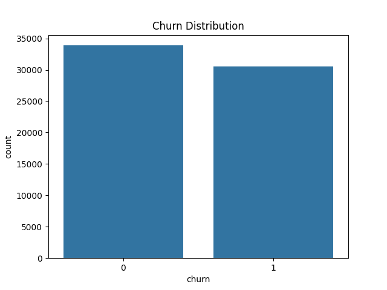
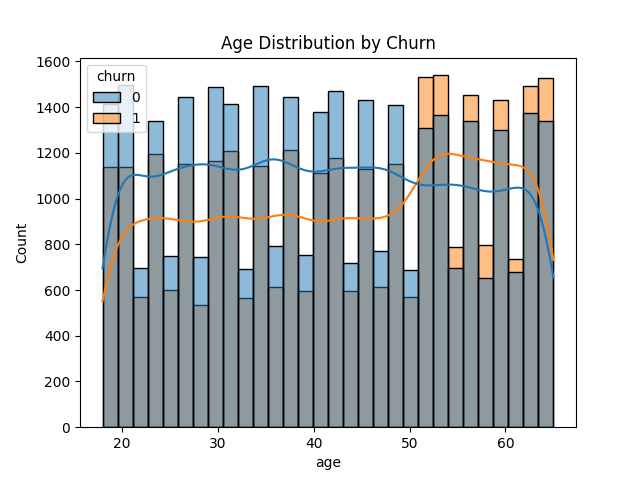
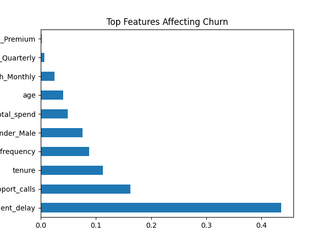
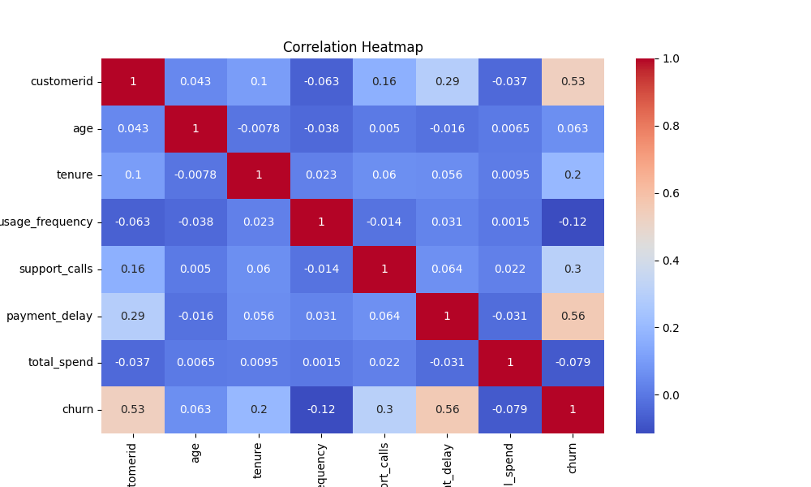

<p align="center">
  <h1 align="center">📊 Customer Churn Analysis & Prediction</h1>
  <p align="center">
    <em>A comprehensive machine learning project to analyze and predict customer churn using real-world telecom data</em>
  </p>
  <p align="center">
    
    
    
    
    
  </p>
</p>

---

## 📋 Table of Contents

- [Overview](#-overview)
- [Dataset](#-dataset)
- [Project Structure](#-project-structure)
- [Key Findings](#-key-findings)
- [Visualizations](#-visualizations)
- [Models & Performance](#-models--performance)
- [Getting Started](#-getting-started)
- [Technologies Used](#-technologies-used)
- [Contributing](#-contributing)

---

## 🔍 Overview

Customer churn is one of the most critical challenges facing subscription-based businesses. This project performs **end-to-end analysis** of customer churn — from data cleaning and exploratory data analysis (EDA) to building predictive machine learning models.

The goal is to:
- **Understand** the key factors driving customer churn
- **Visualize** patterns and trends in customer behavior
- **Predict** which customers are at risk of churning using ML models
- **Identify** actionable insights for customer retention strategies

---

## 📊 Dataset

| Property | Details |
|----------|---------|
| **Source** | Telco Customer Churn Dataset |
| **Records** | 64,374 customers |
| **Features** | 12 attributes |
| **Target Variable** | `Churn` (Binary: 0 = Retained, 1 = Churned) |
| **Missing Values** | None |
| **Duplicates** | None |

### Feature Descriptions

| Feature | Type | Description |
|---------|------|-------------|
| `CustomerID` | Integer | Unique customer identifier |
| `Age` | Integer | Customer's age |
| `Gender` | Categorical | Male / Female |
| `Tenure` | Integer | Duration of subscription (months) |
| `Usage Frequency` | Integer | How frequently the customer uses the service |
| `Support Calls` | Integer | Number of support calls made |
| `Payment Delay` | Integer | Payment delay in days |
| `Subscription Type` | Categorical | Basic / Standard / Premium |
| `Contract Length` | Categorical | Monthly / Quarterly / Annual |
| `Total Spend` | Integer | Total amount spent by the customer |
| `Last Interaction` | Integer | Days since last interaction |
| `Churn` | Binary | Whether the customer churned (1) or not (0) |

### Class Distribution
- **Not Churned (0):** 33,881 customers (52.6%)
- **Churned (1):** 30,493 customers (47.4%)

---

## 📁 Project Structure

```
Customer-Churn-Analysis/
├── data/
│   └── customer_churn_dataset-testing-master.csv   # Raw dataset
├── notebook/
│   └── churn_analysis.ipynb                        # Jupyter notebook with full analysis
├── visuals/
│   ├── churn_distribution.png                      # Churn class distribution
│   ├── age_vs_churn.png                            # Age distribution by churn
│   ├── tenure_vs_churn.png                         # Tenure vs churn boxplot
│   ├── usage_vs_churn.png                          # Usage frequency vs churn
│   ├── support_vs_churn.png                        # Support calls vs churn
│   ├── payment_vs_churn.png                        # Payment delay vs churn
│   ├── subscription_vs_churn.png                   # Subscription type vs churn
│   ├── correlation.png                             # Feature correlation heatmap
│   ├── top_features_affecting_churn.png            # Feature importance chart
│   └── visuals.png                                 # Combined visualizations
├── model.pkl                                       # Serialized trained model
└── README.md                                       # Project documentation
```

---

## 🔑 Key Findings

### Top Factors Driving Customer Churn

| Rank | Feature | Importance Score |
|------|---------|-----------------|
| 🥇 | **Payment Delay** | 0.436 |
| 🥈 | **Support Calls** | 0.163 |
| 🥉 | **Tenure** | 0.113 |
| 4 | Usage Frequency | 0.088 |
| 5 | Gender (Male) | 0.075 |

### Insights

- 📌 **Payment delay** is the **strongest predictor** of churn — customers with higher payment delays are significantly more likely to churn
- 📌 **Support calls** are the second most important factor — more support calls indicate dissatisfaction
- 📌 **Shorter tenure** customers are more prone to churning
- 📌 **Monthly contract** customers churn more than quarterly or annual subscribers
- 📌 Age distribution is roughly uniform across churned and non-churned groups

---

## 📈 Visualizations

### Churn Distribution
<p align="center">
  
</p>

### Age Distribution by Churn Status
<p align="center">
  
</p>

### Top Features Affecting Churn
<p align="center">
  
</p>

### Feature Correlation Heatmap
<p align="center">
  
</p>

---

## 🤖 Models & Performance

Two models were trained and evaluated:

### 1. Logistic Regression

| Metric | Class 0 (No Churn) | Class 1 (Churn) | Overall |
|--------|-------------------|-----------------|---------|
| **Precision** | 0.85 | 0.82 | — |
| **Recall** | 0.83 | 0.83 | — |
| **F1-Score** | 0.84 | 0.82 | — |
| **Accuracy** | — | — | **83.2%** |

### 2. Random Forest Classifier ⭐

| Metric | Value |
|--------|-------|
| **Accuracy** | **99.9%** |

> 🏆 The **Random Forest** model significantly outperforms Logistic Regression and is saved as the production model (`model.pkl`).

### Pipeline Summary

```
Raw Data → Data Cleaning → Feature Engineering → Label Encoding → Standard Scaling → Model Training → Evaluation
```

**Preprocessing Steps:**
1. Column name standardization (lowercase, underscore-separated)
2. Null value handling (forward fill)
3. Duplicate removal
4. Type casting for numeric columns
5. One-hot encoding for categorical variables (`gender`, `subscription_type`, `contract_length`)
6. Feature scaling with `StandardScaler`
7. 80/20 train-test split (random_state=42)

---

## 🚀 Getting Started

### Prerequisites

- Python 3.8+
- Jupyter Notebook

### Installation

1. **Clone the repository**
   ```bash
   git clone https://github.com/Taniiie/Customer_Churn_Analysis.git
   cd Customer_Churn_Analysis
   ```

2. **Install dependencies**
   ```bash
   pip install pandas numpy matplotlib seaborn scikit-learn jupyter
   ```

3. **Launch the notebook**
   ```bash
   jupyter notebook notebook/churn_analysis.ipynb
   ```

4. **Run all cells** to reproduce the analysis and model training.

---

## 🛠 Technologies Used

| Category | Tools |
|----------|-------|
| **Language** | Python 3.11 |
| **Data Manipulation** | Pandas, NumPy |
| **Visualization** | Matplotlib, Seaborn |
| **Machine Learning** | Scikit-learn (Logistic Regression, Random Forest) |
| **Model Serialization** | Pickle |
| **Environment** | Jupyter Notebook |

---

## 🤝 Contributing

Contributions are welcome! Here's how you can help:

1. **Fork** the repository
2. **Create** a feature branch (`git checkout -b feature/amazing-feature`)
3. **Commit** your changes (`git commit -m 'Add amazing feature'`)
4. **Push** to the branch (`git push origin feature/amazing-feature`)
5. **Open** a Pull Request

---

<p align="center">
  <strong>⭐ If you found this project useful, please give it a star! ⭐</strong>
</p>
